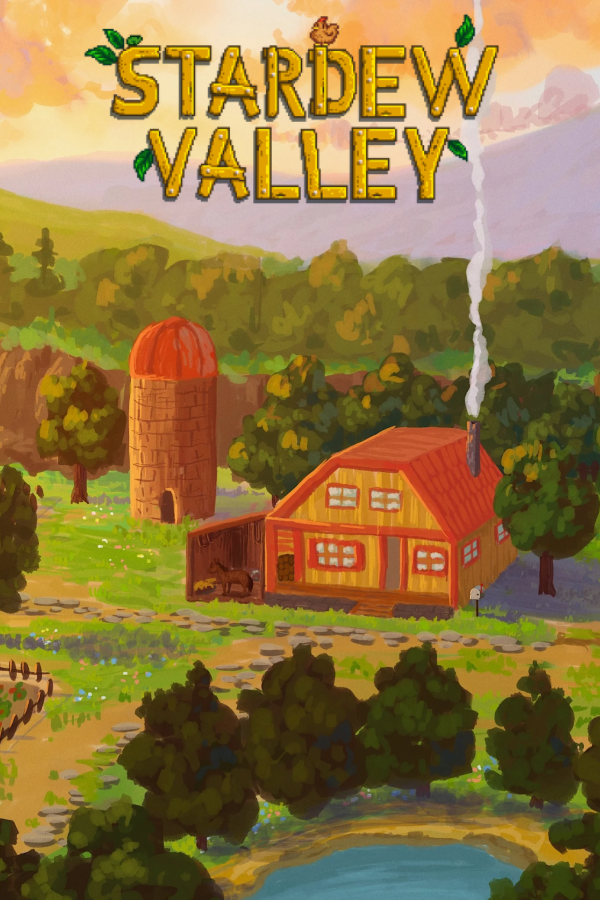
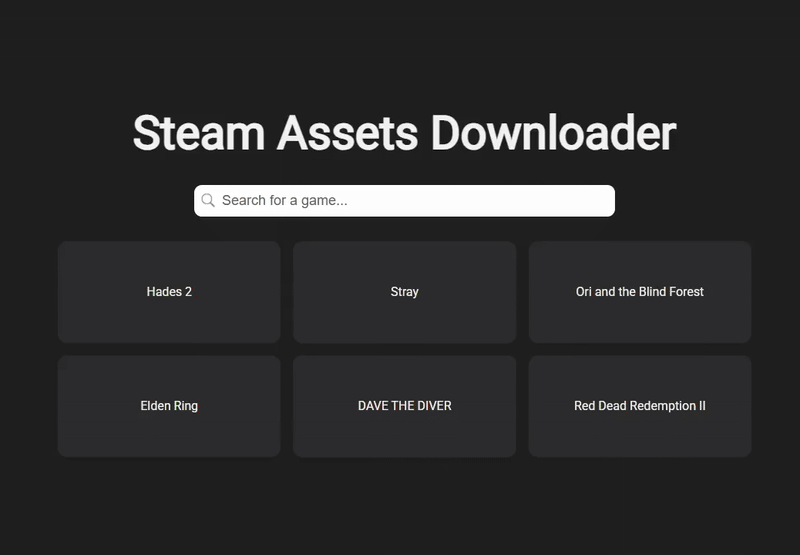
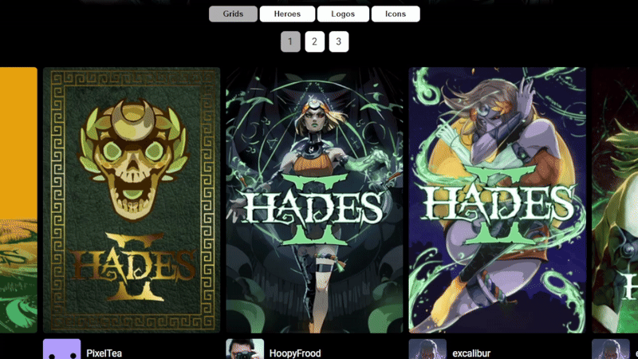
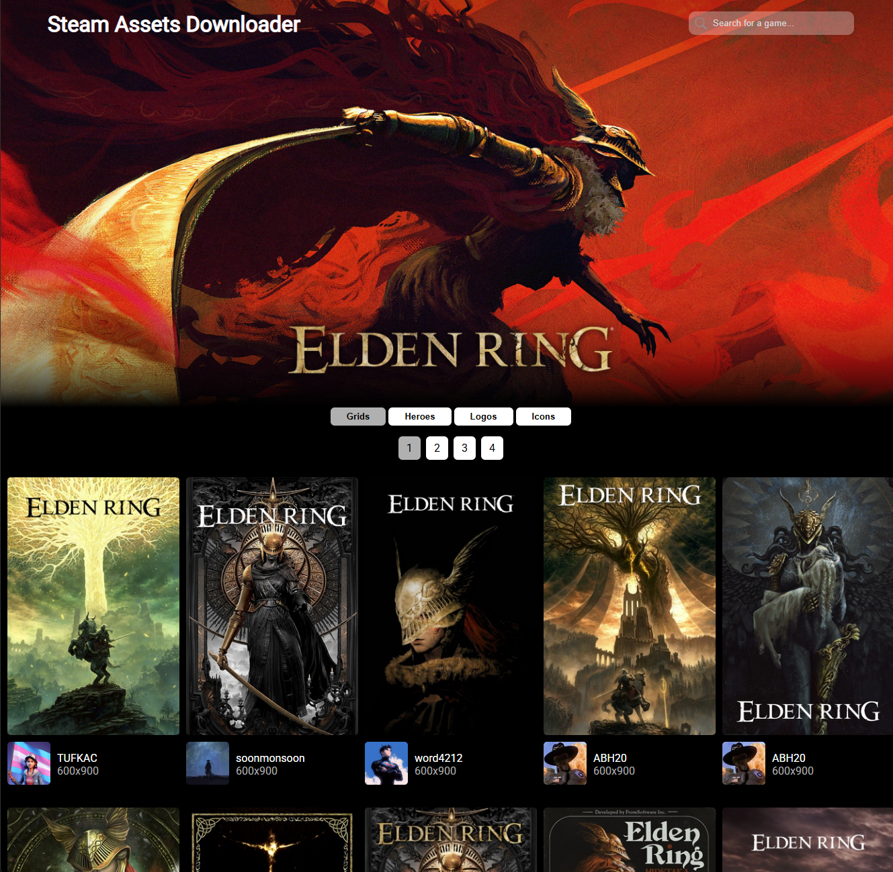
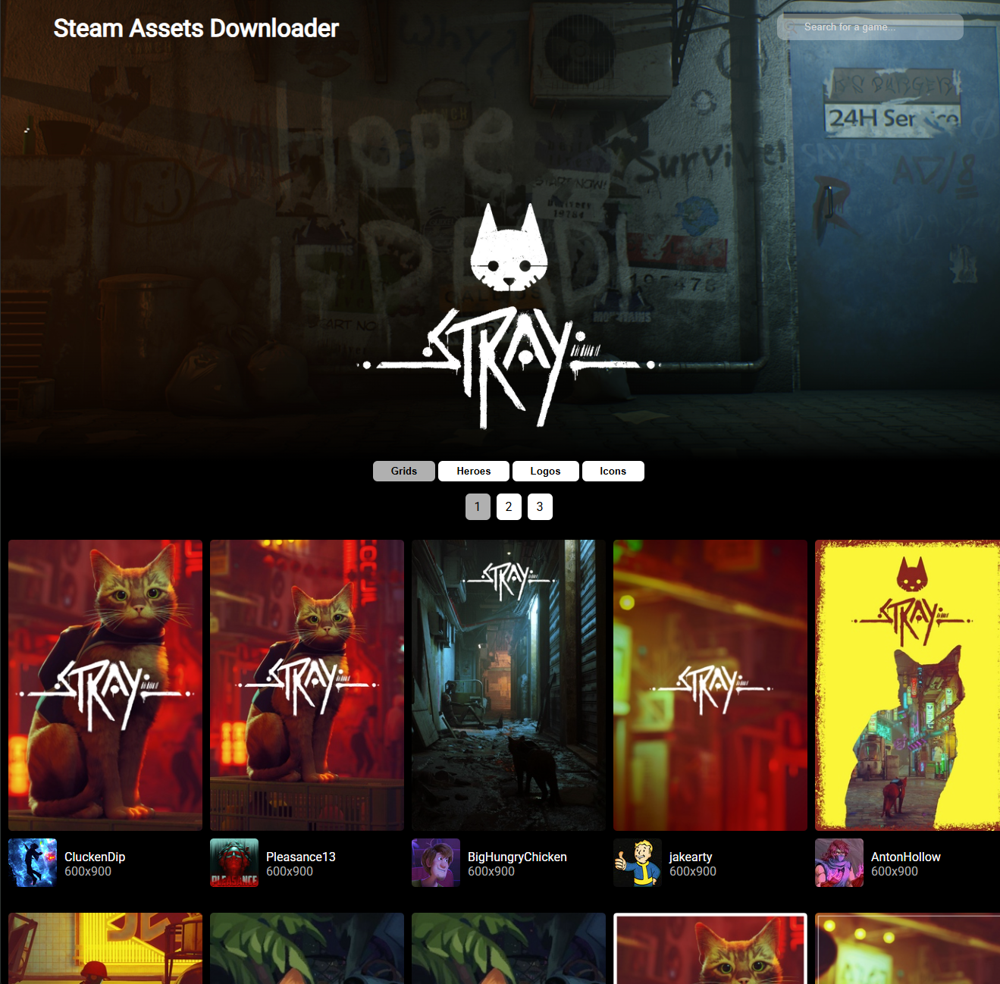

<!-- Title and introduction -->

<h3 align="center">Steam Assets Downloader</h3>
  

    Web application written in C# and TypeScript with usage of the SteamGridDB's API This application allows people to see and download
    a collection of images, uploaded by users. This project was initially made to further my understanding of APIs and to be able to 
    download these assets quickly for my non-steam games.
  

<!-- Table of Contents -->

  
Table of Contents

  <ol>
     <li>
      <a href="#quick-overview">Quick Overview</a>
    </li>
    <li>
      <a href="#examples">Examples</a>
    </li>
    <li>
      <a href="#getting-started">How to Run</a>
    </li>
  </ol>

<!-- Quick Overview -->
<h2 id="quick-overview">Quick Overview</h2>

C# controllers are used in this project to retrieve each category of different assets. This includes the following: grids (similar to thumbnails for games), hero images, logos 
  and icons for steam games.

<table>
  <tr>
    <td>Grid</td>
    <td>Hero</td>
    <td>Logo</td>
    <td>Icon</td>
  </tr>
  <tr>
    <td></td>
    <td></td>
    <td></td>
    <td></td>
  </tr>
</table>

Users are able to search for a game they'd like.

When browsing the assets, users are able to click an image to download it.

(<a href="#readme-top">back to top</a>)

<!-- Screenshots -->
<h2 id="examples">Examples</h2>

### Elden Ring 

  

 

### Red Dead Redemption 2 

  

 

### Stray 

  

 

(<a href="#readme-top">back to top</a>)

